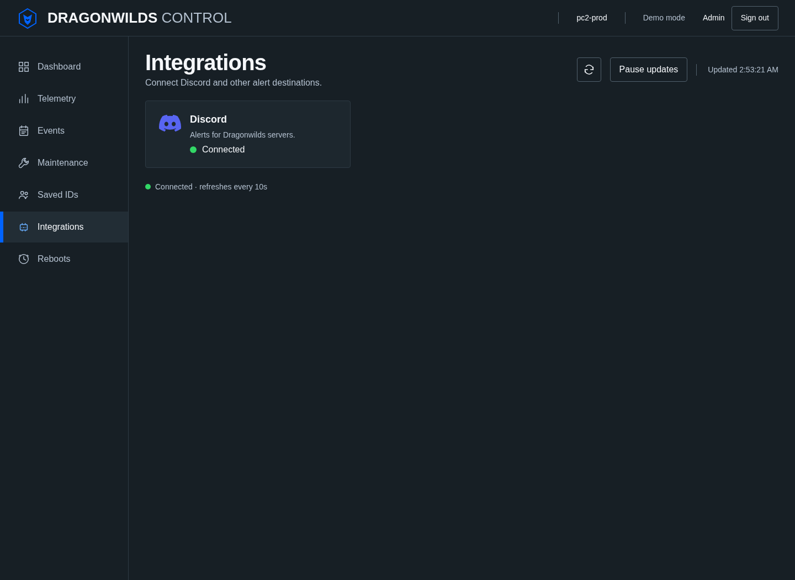

# Discord alerts

The Integrations page is available to admins. OIDC viewers cannot read or change integrations, deliveries, or Secret references. OIDC mutations require the session CSRF token and the configured Origin. Token-mode requests require the admin bearer token. Session changes clear integration lists, delivery history, and open configuration forms.

## Configuration

Create a Discord bot with permission to view the target channel and send messages. Put its token in a pre-created Kubernetes Secret in the C2 namespace. C2 reads that namespace from `RSDW_NAMESPACE`, which the chart supplies through the Downward API. Standalone processes default to `rsdw-system`.

In Integrations, open **Discord**. The card shows Not connected, Connected, or Disconnected. Select **Add Discord bot**. Enter a name, the numeric guild and channel IDs, and the Secret name and key. Select the servers and alert rules, then save. The console accepts a Secret reference only. It has no bot-token input, and its API rejects token fields without echoing their values.

Use **Configure** to change server associations, rules, enabled state, or the Secret reference. Updating the referenced Secret also rotates the token because each attempt reads it again. The bot verifies that the channel belongs to the configured guild before sending. **Send test** queues a test even when automatic alerts are disabled. Recent messages lists each delivery with the Dragonwilds server it belongs to.

Demo mode uses the same configuration and delivery state but simulates sends and restart completion. It does not read Secrets or contact Discord. Production telemetry is not simulated in demo mode.

## Discord messages

Discord notifications contain one colored embed with a fixed title and a playful description that roasts the server or automation. Server alerts include a Server field, using "Unknown server" when the name is empty. Integration tests omit that field. Every embed has a "Dragonwilds C2" footer and includes the event timestamp in UTC when present. Messages disable all mentions.

The Integrations page does not show a separate message preview gallery. Once a delivery exists, Recent deliveries renders the same embed title, description, server, bot, status, and result that apply to that delivery. Integration tests are labeled as bot-level tests because they are not associated with a server.

Visible Discord text excludes raw event messages and details, source and accuracy metadata, operational IDs, endpoints, Secrets, and player identities. Operational IDs remain in C2 delivery records. The delivery ID also remains in the transport nonce. Payload bytes are not persisted.

## API reference

| Request | Result |
| --- | --- |
| `GET /api/integrations` | Configurations, rule definitions, pending restart operations, and the 100 most recently updated deliveries. Each supported delivery includes a rendered `embed` for the Recent deliveries view. |
| `POST /api/integrations` | Create a Discord bot configuration |
| `PUT /api/integrations/{id}` | Replace a configuration, including its Secret reference |
| `POST /api/integrations/{id}/test` | Queue a test and return its stable delivery ID with HTTP 202 |

Create and update bodies contain `name`, `enabled`, `guildId`, `channelId`, `secretRef: {name, key}`, `serverIds`, and `rules`, a map from event kind to boolean. IDs are assigned by C2 and are not accepted in request bodies. Missing rules are disabled. Unknown fields, unknown rules, duplicate or nonexistent server IDs, and enabled backup rules are rejected. There is no scheduling, quiet-hours, raw token, or webhook URL field.

Configuration changes apply to new events. Disabling an integration or rule, disconnecting a server, or changing the target cancels affected pending and retry deliveries. Re-enabling does not replay them or historical events. A send already in progress may finish against its original target. Secret rotation applies to the next attempt. An in-flight attempt may finish with the old Secret.

## Event reference

Each event has an immutable `id`, `kind`, `source`, `accuracy`, timestamp, server identity, and optional `operationId`. Event creation and delivery creation share one Store update.

| Kind | Meaning |
| --- | --- |
| `restart_requested` | C2 durably recorded a restart operation before issuing the Kubernetes command. This does not assert that Kubernetes accepted it. |
| `restart_completed` | A fresh, owned runtime has the operation's Pod-template annotation, a different runtime identity, a start time at or after the request at Kubernetes' second precision, and both Pod and engine readiness. |
| `restart_failed` | After five minutes, a fresh definitive observation still cannot confirm a ready marked replacement. |
| `player_joined` | An approximate increase between fresh player counts on the same healthy runtime. C2 event details include the count delta. The Discord embed describes the observation without raw details. No identities or exact joins are inferred. |
| `player_limit_reached` | A fresh count crosses from below the configured limit to at least the limit. Falling below rearms the rule. Changing the configured limit establishes a new threshold baseline. |
| `server_down` | After a healthy baseline, three consecutive definitive unhealthy observations span at least 30 seconds. |
| `server_recovered` | After an established outage, two consecutive healthy observations span at least 15 seconds. |
| `backup_started`, `backup_completed`, `backup_failed` | Reserved, visibly unavailable rules. No backup producer exists. Enabling them is rejected. Save import does not count as a backup. |

Runtime identity combines the owned Pod UID and server container ID. The existing collector checks Deployment, ReplicaSet, and Pod ownership and verifies container identity again after collection. A scaled-to-zero Deployment, no active owned Pod, a non-running server container, Pod unreadiness, or an explicit false engine-ready result is definitive unhealthy evidence. Discovery failures, ambiguous Pod selection, failed identity verification, and game API transport or parse failures with an otherwise ready Pod are unknown.

The first healthy observation establishes the health baseline. Initial unhealthy observations cannot emit down alerts. The first player observation, runtime replacement, missing player reading, or gap over 45 seconds establishes a new player baseline without an alert. Duplicate and out-of-order observations do not advance producers. Unknown health and gaps over 45 seconds reset short debounce streaks.

C2 persists established outages and pending restart operations across process restarts, but resets short streaks and player baselines. Restart commands patch the Pod-template annotation `rsdw-c2/restart-operation`. Restart completion requires the marker even when C2 had no prior runtime observation. Command failures and timeouts return HTTP 202 and remain pending for telemetry reconciliation. Collection unknown does not become restart failure; an overdue operation remains visible on Integrations until a definitive observation arrives. A marked healthy replacement can complete a pending restart after an observation gap. A second restart is rejected while one is pending.

During a tracked restart, C2 suppresses player and down/recovered alerts. Completion or failure resets the player baseline and short streaks. A pre-existing outage remains established and can recover after two subsequent healthy observations.

## Delivery reference

The queue is independent of the 500-event display history. Each event and integration pair has one stable 24-character delivery ID derived from their IDs. The queue stores an immutable event copy and guild/channel target, never a token. C2 retains the newest 100 sent or failed deliveries, plus every pending, retrying, sending, or uncertain delivery. The API displays the most recent 100 records. C2 queues new events only; pruning completed history does not replay old events when it restarts or an integration is enabled again. This JSON-backed implementation is intended for one C2 replica.

| State | Meaning |
| --- | --- |
| `pending` | Queued, no attempt claimed |
| `sending` | Claim and attempt count persisted before Secret or network access |
| `sent` | Discord returned a successful response, or demo mode simulated delivery |
| `retry` | A failure before message submission or a message rate-limit response permits a bounded retry |
| `failed` | Configuration cancelled the delivery, Discord rejected it, channel verification failed, or the retry limit was reached |
| `uncertain` | A message may have been accepted, but C2 cannot confirm the result. No automatic retry. |

There are at most five attempts. Safe retries use exponential delays of 2, 4, 8, and 16 seconds, extended by Discord's retry delay. A rate limit conservatively pauses all Discord deliveries, including after C2 restarts. The sender honors numeric `Retry-After`, `retry_after`, and reset-after headers. It uses a fixed HTTPS Discord API endpoint, refuses redirects, and disables all mentions. Secret lookup and HTTP failure details are discarded and replaced with fixed messages.

A timeout, connection error, HTTP 408, or HTTP 5xx during message submission is uncertain. HTTP 5xx during the read-only channel check can retry. A persisted `sending` record becomes uncertain after a C2 restart, including a crash after send but before result persistence. If result persistence fails in a running process, the next worker pass marks it uncertain without sending again. File and directory synchronization precede successful Store commits. Secret and HTTP I/O occur outside the Store lock.

The delivery ID is also a Discord nonce with `enforce_nonce` enabled. Discord's nonce check has a limited time window and does not prove exactly-once delivery. For an uncertain result, compare the channel's messages with the event kind, server name, and timestamp in C2 before taking action. Event and delivery IDs are not visible in Discord text. C2 does not automatically replay uncertain or failed alerts. A new test is an explicit new event.

The sender follows the [Discord message API](https://docs.discord.com/developers/resources/message#create-message) and [rate-limit contract](https://docs.discord.com/developers/topics/rate-limits).

## Verification

Go tests use a fake Discord transport and fake Kubernetes commands. They cover producer baselines, all available event kinds, unavailable backup rules, migration and cloning, admin and CSRF policy, Secret leakage, rate limits, bounded retries, crash uncertainty, retention, and Store-lock independence.

Run `go test -race ./...` and `bash scripts/verify.sh`. With Playwright and Chromium available, run `node tests/integrations-browser.cjs` after the verify script builds `.tmp/rsdw-c2`. Set `NODE_PATH` when Playwright is outside the repository and `RSDW_TEST_CHROMIUM` to select a browser binary. The browser check uses temporary state and demo mode. It does not validate live Discord permissions or a live Kubernetes rollout.
